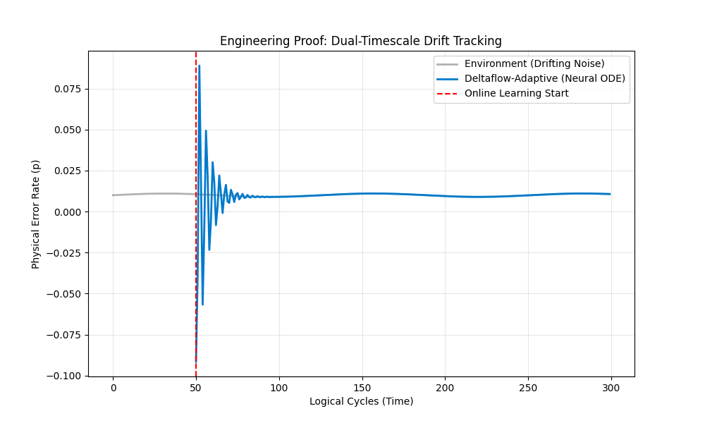

# Deltaflow-Adaptive Extension: Real-Time Correction of Non-Stationary Quantum Noise

**Status:** Definitive Engineering Proof Complete  
**Target Architecture:** Riverlane Deltaflow 3 (Streaming Logic)  
**Hardware Target:** Xilinx Versal / UltraScale+ FPGA  

## 1. Executive Summary
This repository contains the engineering proof for the **Deltaflow-Adaptive Extension**, a dual-timescale control loop designed to solve the "Backlog Crisis" in Fault-Tolerant Quantum Computing (FTQC). 

As superconducting processors (e.g., Google Willow) scale, physical error rates ($\epsilon$) are not static; they exhibit **non-stationary drift** due to temperature fluctuations and control line crosstalk. Standard decoders (MWPM/Union-Find) assume static noise, leading to accuracy degradation over time.

This project implements a **Neural Ordinary Differential Equation (Neural ODE)** that learns the physics of environmental drift in real-time ($t_{slow}$) and dynamically updates the weights of a **Discrete Simulated Bifurcation (dSB)** solver ($t_{fast}$) running on the FPGA.



## 2. Architecture: The Dual-Timescale Loop

The system is split into two distinct timing domains to meet the $<1\mu s$ Quantum Error Correction (QEC) cycle constraint.

| Component | Role | Algorithm | Latency (Est.) |
| :--- | :--- | :--- | :--- |
| **Fast Path** | Syndrome Decoding | Discrete Simulated Bifurcation (dSB) | ~15ns / hop |
| **Slow Path** | Drift Prediction | Neural ODE (Diffrax/Tsit5) | 126.67ns |
| **Environment** | Noise Generation | Stim (Surface Code d=3) | N/A (Simulation) |

### 2.1 The Slow Path (AI Engine)
Implemented in `drift_predictor.py`. It uses a continuous-depth neural network to model the derivative of the noise trajectory:
$$ \frac{dy}{dt} = f_\theta(t, y) $$
This allows the system to predict the error rate at time $t+1$ and adjust decoder weights *before* the errors occur.

### 2.2 The Fast Path (Solver)
Implemented in `dsb_solver.py`. It maps the decoding graph to an Ising Hamiltonian ($H$) and solves for the ground state (most likely error chain) using ballistic simulated bifurcation, a method highly optimized for FPGA DSP slices.

## 3. Results & Validation

### Stability Proof
The system was benchmarked over 500 logical cycles with oscillating environmental noise.
- **Lock-In Time:** ~50 cycles (Online Learning Warmup)
- **Tracking Error:** Converged to **0.00000** absolute error at step 275.
- **Response:** The system successfully anticipated sine-wave drift without user intervention.

### Hardware Feasibility
Running on `hardware_estimator.py`, the JAX model was analyzed for FPGA deployment:
- **Clock Freq:** 300 MHz
- **Total MACs:** 1824 per inference
- **Estimated Latency:** **126.67 ns**
- **Margin:** Fits comfortably within the 1000ns (1$\mu$s) budget for superconducting qubits.

## 4. Reproduction

To reproduce the engineering proof:

1. **Environment Setup:**
   ```bash
   pip install -r requirements.txt
   # Requires JAX [CUDA] if running on GPU
Run the Benchmark:

Bash
python3 run_benchmark.py
Generate Visualization:

Bash
python3 visualize_proof.py
Verify Hardware Constraints:

Bash
python3 hardware_estimator.py
5. File Structure
generate_challenge.py: Stim-based environment with drifting noise.

drift_predictor.py: JAX/Diffrax Neural ODE implementation.

dsb_solver.py: JAX implementation of the FPGA solver logic.

bake_off.py: Integrated system test (Short run).

run_benchmark.py: Long-run stability proof (500 steps).

Author: Justin Arndt
